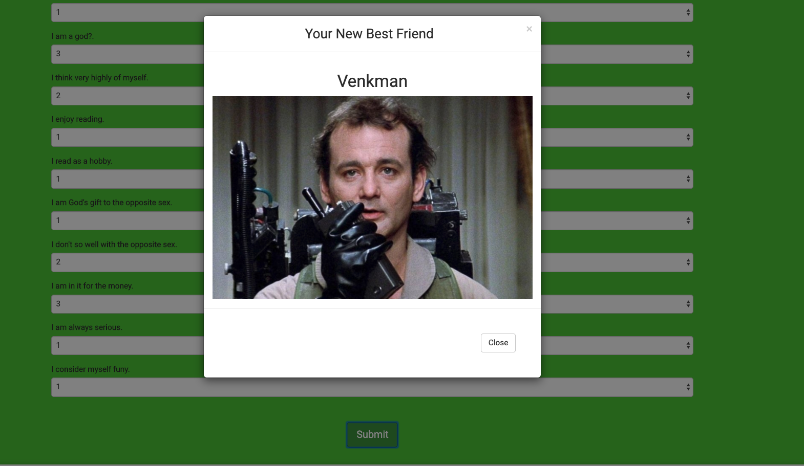

# Match Maker

### Match Maker Application Description
Match Maker implements friend matching based on the user's responses to a ten question survey. The user responds to questions with values from 1 (Strongly Disagree) to 5 (Strongly Agree). When the survey is submitted, an existing user record closest to the current user's responses is found and returned. The closest set of user responses is defined as the set with the lowest absolute difference for all ten questions combined.


### Find your match [Here!]()

## Usage
___

To use our app, simply go to our homepage and take our state-of-the-art survey. Immediately after submitting the survey, your match will pop up. 




## Requirements
* 10 question survey to assess uniqueness of users
* Modularity in the form of separate files for server logic, storing of friends, views, and routing
* Use express, body-parser, and path npm packages in the server.js file

* Calculate best match for user once survey is completed and return that match to the user

## Technologies Used
* JavaScript
* Express.js
* node.js
* jQuery
* HTML
* Bootstrap

## Code Explanation
Our server.js file sets up the Express server,specifying our port number, the npm packages that need to be loaded, and also the routes, which we have externalized
There are 2 separate HTML files (home.html and survey.html) that serve as the front-end portion of our code; they determine what the user sees (the homepage and the survey, which will also show the resulting best match)
Our 2 routing files (html-routes.js and api-routes.js) determine the back-end logic (based on the request being made, the response that gets sent to the browser); the HTML routes display the survey and the homepage based on the URL that is accessed, and the API routes send back existing content in our server-side data or add new friends
Best match is calculated by finding the friend with the minimal difference in scores and then sending that friend to the browser as a JSON object
A modal is then toggled, displaying the the best match to the person who just took the survey

Friends are stored as such:
```
{
    name: "Egon",
	photo:"https://cdn.pinkvilla.com/files/styles/contentpreview/public/ghostbusters_3.jpg?itok=UpPf24_k",
	scores: [2, 5, 4, 1, 2, 3, 3, 2, 3, 3]
}
```

